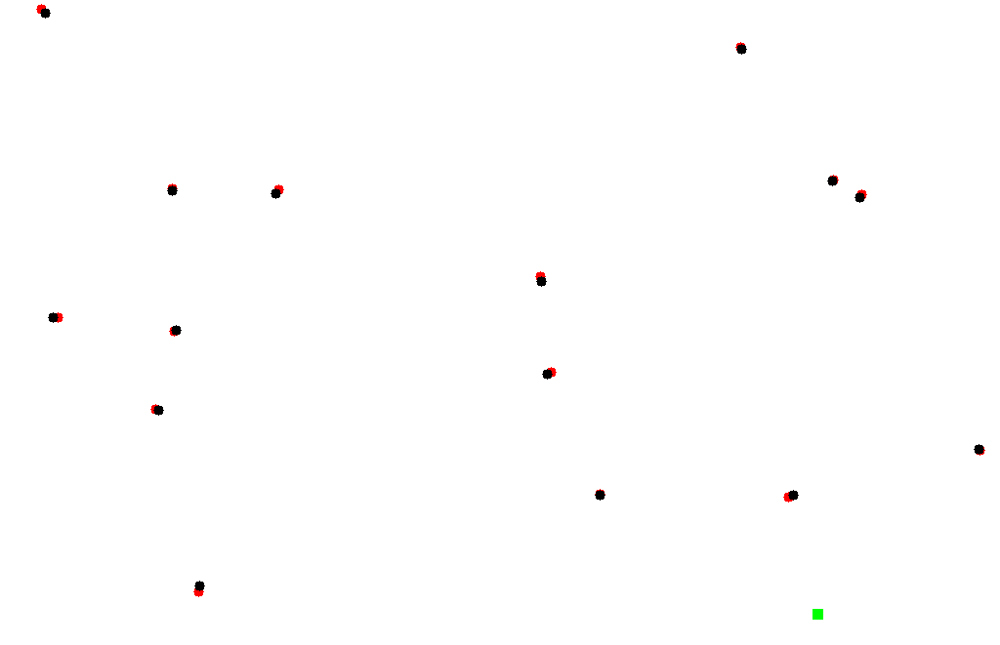

# Kalman Filter in Autonomous Vehicles
This project simulates an autonomous delivery robot that uses `Kalman Filter` to filter out noises in Lidar readings. Based on these data, the robot can detect pedestrians location and find its way to the delivery point while avoiding pedestrians.

## How to run
### A. Install dependencies
1. Using conda:
   ```
   $ git clone https://github.com/afakhry01/kalman-filter
   $ cd kalman-filter
   $ conda env update -f environment.yml
   $ conda activate kf
   ```
    If you need instructions on installing conda, you can find them [here](https://docs.conda.io/en/latest/miniconda.html)
1. Using pip:
   ```
   TODO
   ```
### B. Run simulation
A temporary simulation is being used now to show the accuracy of Kalman Filter prediction. An improved simulation will be delivered soon.
```
$ python scene.py
```

## Preview
The `black dots` are the true pedestrians location, `red dots` are the Kalman Filter predictions and the `green square` is the autonomous delivery robot. The lidar has noise with `median = 0` unit distance and `standard deviation = 5` unit distance. Pedestrians move at `speed = 1` unit distance. This screenshot was taken after the filter stabilization (after 15 frames).



## TODO List
- [X] Build Kalman Filter
- [X] Implement pedestrians, autonomous vehicle and lidar
- [X] Create simulation ui
- [ ] Adjust the autonomous vehicle to navigate through pedestrians and deliver orders
- [ ] Improve simulation
- [ ] Add streamlit interface